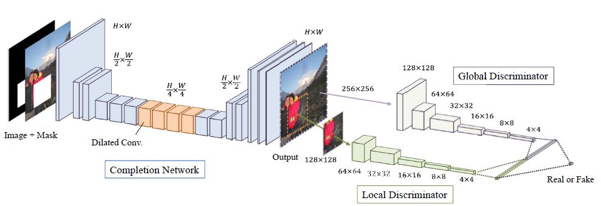
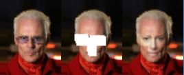
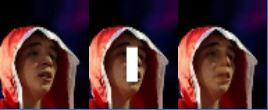
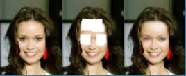
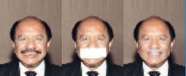

# Globally and Locally Consistent Image Completion

Tensorflow implementation of Globally and Locally Consistent Image Completion on CelebA dataset.  
  


## What's different from the paper  
* smaller image input size (64x64)  
* smaller patch sizes  
* less number of training iteration (500,000 iterations in the paper)


## Data
* [celebA](http://mmlab.ie.cuhk.edu.hk/projects/CelebA.html)  

## Folder Setting
```
-data
  -img_align_celeba
    -img1.jpg
    -img2.jpg
    -...
```


## Train
```
$ python train.py 
```

To continue training  
```
$ python train.py --continue_training=True
```

## Test  
```
$ python test.py --img_path=./data/test/test_img.jpg
```


Use your mouse to erase pixels in the image.  
When you're done press ENTER.  
Result will be shown in few seconds.  


## Results  

  
  
  
  
  
  
